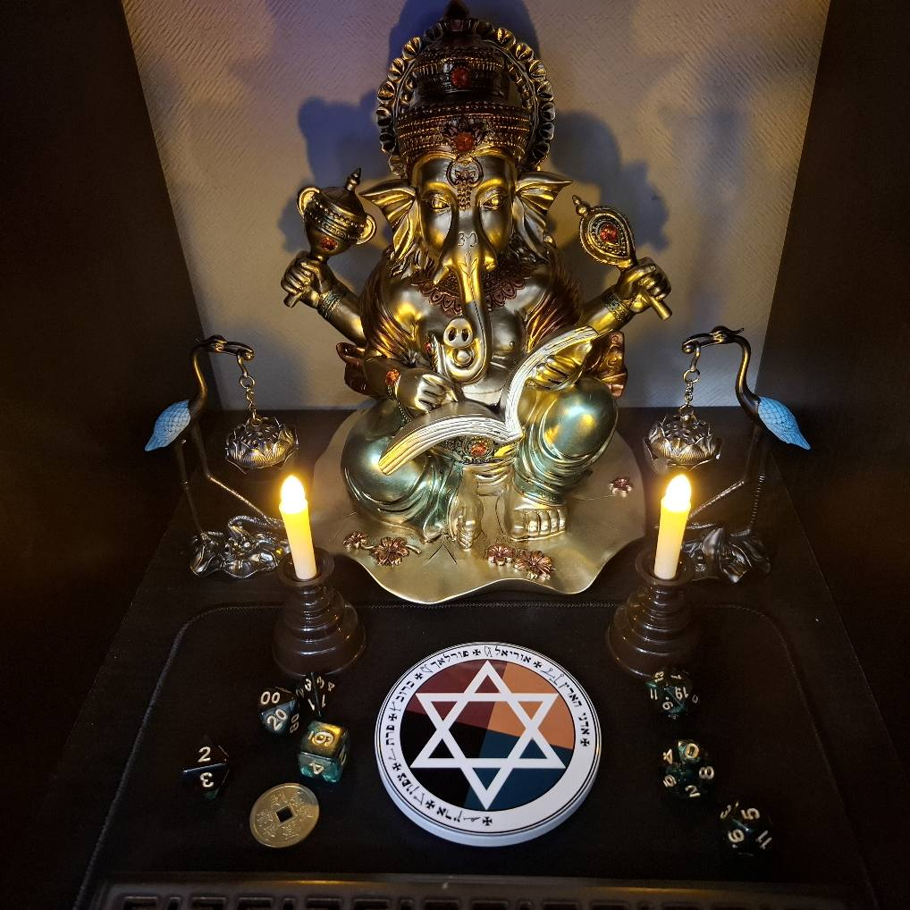

# 🙏 ガネーシャ神殿での日拝（Daily Devotion）

この簡易儀式は、毎朝の「感謝」と「意図の整え」を目的とした日常的なワークです。神殿に向かい、心を落ち着け、日々の流れに調和をもたらすガネーシャの恩寵を受け取ります。

---

## 🌄 実施タイミング
- 朝の時間帯（出勤・作業・学習の前など）
- リラックスできる静かなタイミング（無理せず）

---

## 🔧 必要なもの
- ガネーシャ像（神殿）
- お香またはキャンドル
- 短い時間（3〜5分）

---

## 🪔 手順

1. **神殿に向かい、深呼吸を3回**
   - 背筋を伸ばし、静かに意識を整える。

2. **お香に火を灯す**
   - 香の煙を“障害を浄化する象徴”として扱う。

3. **マントラを唱える（3回）**
   > Om Gam Ganapataye Namaha（オーム・ガム・ガナパタイェ・ナマハ）

   🎧 YouTube音源の参考:  
   https://www.youtube.com/watch?v=e4GljJzSiAQ

4. **以下の短い祈りを唱える**（英語 → 日本語訳）

   > Ganesha, Lord of Beginnings and Remover of Obstacles,  
   > Clear my path today.  
   > Bless my body with strength, my mind with clarity,  
   > and my home with peace.  
   > Thank you for your presence.

   （訳）  
   > ガネーシャよ、始まりの主にして障害を取り除く神よ、  
   > 今日の私の道を清めてください。  
   > 私の体に力を、心に明晰さを、家庭に平穏を授けてください。  
   > あなたのご加護に感謝します。

5. **IAOM（イー・アー・オーム）を一度、力強く唱える**
   - 祈りの締めくくりとして、意図を顕現させるための振動を送る。

6. **マントラをもう一度3回唱える**
   > Om Gam Ganapataye Namaha × 3

7. **一礼して終了**
   - 両手を胸の前で合わせる、もしくは軽く頭を下げる。

---

## 🖼️ 神殿の写真

---

## 📌 備考
- マントラは自分の声で出せる時は発声、難しい時は音源に意識を合わせるだけでも可。
- 必要があれば、タロットカードを1枚引いてその日のメッセージとして受け取るのも良い。
- 「IAOM」は「意図（I）→活性（A）→拡張（O）→顕現（M）」のプロセスを象徴します。

---

## 📘 LICENSE
このテンプレートは Creative Commons Attribution 4.0 International (CC BY 4.0) ライセンスのもとで公開されています。

🕉️ "Every day begins with removal of obstacles."
